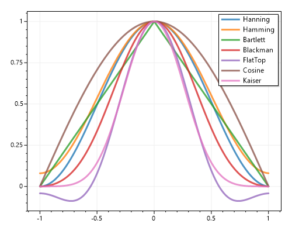

#  FftSharp

[](https://github.com/swharden/FftSharp/actions/workflows/ci.yaml)
[](https://www.nuget.org/packages/FftSharp/)
[](https://www.nuget.org/packages/FftSharp/)
[](LICENSE)


**FftSharp is a collection of Fast Fourier Transform (FFT) tools for .NET.** FftSharp is provided under the permissive [MIT license](LICENSE) so it is suitable for use in commercial applications. FftSharp targets .NET Standard and has no dependencies so it can be easily used in cross-platform .NET Framework and .NET Core applications.

### Quickstart

```cs
// Start with some data
double[] audio = FftSharp.SampleData.SampleAudio1();

// Window your signal
double[] window = FftSharp.Window.Hanning(audio.Length);
FftSharp.Window.ApplyInPlace(window, audio);

// Calculate power spectral density (dB)
double[] fftPower = FftSharp.Transform.FFTpower(audio);
```

Audio | Windowed | FFT
---|---|---
||

A quickstart application ([Program.cs](src/FftSharp.Quickstart/Program.cs)) demonstrates common FftSharp features. The quickstart program generates the graphs shown here, but plotting-related code has been omitted from these code samples.

## Usage

### Installation

FftSharp is available on NuGet:
* https://www.nuget.org/packages/FftSharp/


### Sample Data

```cs
// sample audio with tones at 2, 10, and 20 kHz plus white noise
double[] audio = FftSharp.SampleData.SampleAudio1();
int sampleRate = 48000;
```

<div align="center">


</div>

### Calculate the Power Spectral Density (PSD)

Most people interested in FFT software are attempting to calculate the [power spectral density (PSD)](https://en.wikipedia.org/wiki/Spectral_density) of a signal, usually reported in [dB](https://en.wikipedia.org/wiki/Decibel) units. Knowing this, FftSharp makes it easy to go straight from signal to power spectrum:

```cs
double[] fftPower = FftSharp.Transform.FFTpower(audio);
```

Knowing you're interested in how these data line-up with frequencies, we also make it easy to get the list of frequencies corresponding to each point on the power spectrum:

```cs
double[] freqs = FftSharp.Transform.FFTfreq(sampleRate, fftPower.Length);
```

Power vs. frequency can then be plotted to yield a [periodogram](https://en.wikipedia.org/wiki/Periodogram):

<div align="center">


</div>

### Calculate the FFT using Complex Numbers

If you enjoy working with real and imaginary components of complex numbers, you can build your own complex array and call `FFT()` directly which performs the transformation _in-place_ on a `Complex[]` array:

```cs
// Start with some data
double[] audio = FftSharp.SampleData.SampleAudio1();

// convert the data to an array of complex numbers
Complex[] buffer = new Complex[audio.Length];
for (int i=0; i<buffer.Length; i++)
    buffer[i] = new Complex(audio[i], 0);

// compute the FFT in-place
FftSharp.Transform.FFT(buffer);
```

## Filtering

The `FftSharp.Filter` module has methods to apply low-pass, high-pass, band-pass, and band-stop filtering.

```cs
double[] audio = FftSharp.SampleData.SampleAudio1();
double[] filtered = FftSharp.Filter.LowPass(audio, sampleRate, maxFrequency: 2000);
```


## Windowing

Signals are often are _windowed_ prior to FFT analysis. Windowing is essentially multiplying the waveform by a bell-shaped curve prior to analysis. The `FftSharp.Window` module provides easy access to many common window functions.

<div align="center">



</div>

The Hanning window is the most common window for general-purpose FFT analysis. Other window functions may have different _scallop loss_ or _spectral leakage_ properties. For more information review [window functions](https://en.wikipedia.org/wiki/Window_function) on Wikipedia.

```cs
// Apply a Hanning window to the audio prior to FFT analysis
double[] window = FftSharp.Window.Hanning(audio.Length);
FftSharp.Window.ApplyInPlace(window, audio);
```

Hanning Window | Power Spectral Density
---|---
|

Windowing signals prior to calculating the FFT improves signal-to-noise ratio at lower frequencies, making power spectrum peaks easier to resolve.

No Window | Power Spectral Density
---|---
|

## Mel Scaling

Analyses aimed at achieving maximum frequency resolution present power spectral density using linear scaling, where every point is evenly spaced in the frequency domain. However, biological sensory systems tend to be logarithmic, and the human ear can differentiate frequency shifts better at lower frequencies than at higher ones.


To visualize frequency in a way that mimics human perception we scale data so lower frequencies have more resolution than higher frequencies. The [Mel Scale](https://en.wikipedia.org/wiki/Mel_scale) is commonly used to represent power spectral density this way, and the resulting _Mel Periodogram_ has greatly reduced total frequency resolution but is a better representation of human frequency perception. 

Several methods starting with `FftSharp.Transform.Mel` facilitate conversion between a linear frequency scale and the Mel scale. The image above was produced using the following code:

```cs
double[] audio = SampleData.SampleAudio1();
int sampleRate = 48000;
int melBinCount = 20;

double[] fftMag = FftSharp.Transform.FFTmagnitude(audio);
double[] fftMagMel = FftSharp.Transform.MelScale(fftMag, sampleRate, melBinCount);
```

## Demo Application

A graphical demo application is included in this project which uses [ScottPlot](https://swharden.com/scottplot/) to interactively display an audio signal next to its FFT.

<div align="center">


</div>

## Microphone Demo

This project also contains a realtime FFT microphone demo which continuously monitors a sound card input device and calculates the FFT and displays it in real time. This demo uses [NAudio](https://github.com/naudio/NAudio) to interface the sound card, [FftSharp](https://github.com/swharden/FftSharp) to calculate the FFT, and [ScottPlot](https://github.com/swharden/ScottPlot) to display to result.


You can download this program as a click-to-run EXE to try-out this library without having to compile this project from source:

* Download for Windows: [FftSharp-demo.zip](https://github.com/swharden/FftSharp/raw/master/dev/FftSharp-demo.zip)

## Spectrogram

A spectrogram is a visual representation of the spectrum of frequencies of a signal as it varies with time. Spectrograms are created by computing power spectral density of a small window of an audio signal, moving the window forward in time, and repeating until the end of the signal is reached. In a spectrogram the horizontal axis represents time, the vertical axis represents frequency, and the pixel intensity represents spectral magnitude or power.

[Spectrogram](https://github.com/swharden/Spectrogram) is a .NET library for creating spectrograms.

<div align="center">


_I'm sorry Dave... I'm afraid I can't do that_

</div>
