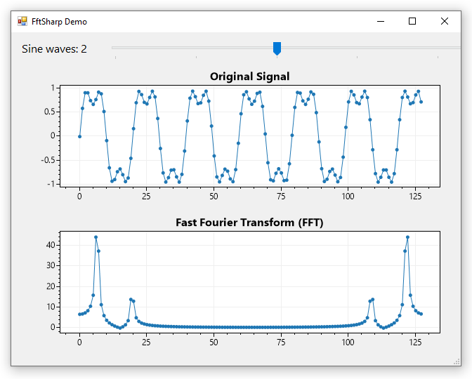

# FftSharp

[](https://dev.azure.com/swharden/swharden/_build/latest?definitionId=8&branchName=master)
<!--[](https://www.nuget.org/packages/FftSharp/)-->
[](https://www.nuget.org/packages/FftSharp/)

**FftSharp is a collection of Fast Fourier Transform (FFT) tools for .NET.** FftSharp is provided under the permissive [MIT license](LICENSE) so it is suitable for use in commercial applications. FftSharp targets .NET Standard and has no dependencies so it can be easily used in cross-platform .NET Framework and .NET Core applications.

<div align="center">



</div>

## Installation

FftSharp is available on NuGet:
* https://www.nuget.org/packages/FftSharp/

## Quickstart

A quickstart application ([Program.cs](src/FftSharp.Quickstart/Program.cs)) demonstrates common FftSharp features. The quickstart program generates the graphs shown here, but plotting-related code has been omitted from these code samples.

> **⚠️ WARNING:** FftSharp is early in development and its public API may change as it continues to mature. Source code and examples in this repository may deviate from the API in the latest NuGet package.

### Sample Data

```cs
// sample audio with tones at 2, 10, and 20 kHz plus white noise
double[] audio = FftSharp.SampleData.SampleAudio1();
int sampleRate = 48000;
```


### Calculate the Power Spectral Density (PSD)

Most people interested in FFT software are attempting to calculate the [power spectral density (PSD)](https://en.wikipedia.org/wiki/Spectral_density) of a signal, usually reported in [dB](https://en.wikipedia.org/wiki/Decibel) units. Knowing this, FftSharp makes it easy to go straight from signal to power spectrum:

```cs
double[] fftPower = FftSharp.Transform.FFTpower(audio);
```

Knowing you're interested in how these data line-up with frequencies, we also make it easy to get the list of frequencies corresponding to each point on the power spectrum:

```cs
double[] freqs = FftSharp.Transform.FFTfreq(sampleRate, fftPower.Length);
```

Power vs. frequency can then be plotted to yield a [periodogram](https://en.wikipedia.org/wiki/Periodogram):


### Calculate the FFT using Complex Numbers

If you enjoy working with complex numbers with real and imaginary components, you can call `FFT()` directly. Unlike many other FFT libraries which use their own complex number modules, FftSharp simply uses the [Complex struct](https://docs.microsoft.com/en-us/dotnet/api/system.numerics.complex) provided by the [standard Numerics .NET library](https://docs.microsoft.com/en-us/dotnet/standard/numerics).

```cs
System.Numerics.Complex[] fft = FftSharp.Transform.FFT(audio);
```

The FFT is typically calculated using a complex number array as input. However, an overload is available which allows the user to define real values and assume the imaginary values are zero.

## Demo Application

A graphical demo application is included in this project which uses [ScottPlot](https://swharden.com/scottplot/) to interactively display an audio signal next to its FFT.


